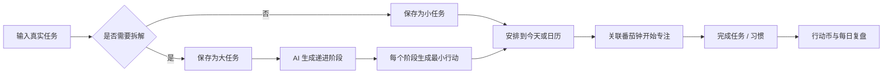
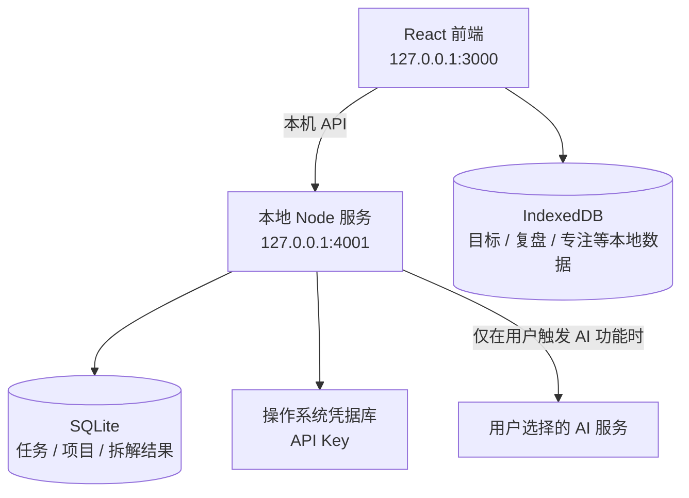

# Energy Action

> Energy Action Community — 把复杂目标拆成现在就能开始的一步。

Energy Action 是一个本地优先、AI 可选的个人执行系统。它不只记录“要做什么”，而是把一个有压力的大目标逐步变成阶段、小任务和此刻可执行的最小行动，再连接日程、专注与完成反馈，帮助用户从“知道该做”进入“现在能开始”。

当前仓库是可在个人电脑运行的 Community Preview。无需账号，不配置 AI 也能使用任务、目标、日历、番茄钟和复盘；配置自己的模型 API 后，才能使用任务拆解与最小行动生成。

## 核心闭环



这里的“最小行动”不是再写一份计划，而是一个无需继续准备、可以立刻开始、并能实际推进目标的动作。例如：

- 目标：坚持健身一个月
- 阶段：完成第一次家庭健身
- 最小行动：现在换上运动服，原地开合跳 20 次

## 已实现能力

- **今日执行中心**：只呈现今天需要关注的大任务、习惯、固定任务与逾期事项。
- **目标与关键结果**：维护短期、中期和长期目标，并记录 KR 与进展。
- **大小任务分流**：创建任务时由用户决定直接执行，或归类为需要拆解的大任务。
- **AI 阶段拆解**：通过项目内置 Harness 与 Skills 生成递进阶段，并为每个阶段提供最小行动。
- **可编辑任务树**：阶段、子任务和最小行动可展开、完成、修改；AI 结果不是不可更改的答案。
- **月度任务视图**：按月查看任务，避免其他月份的内容混入当前列表。
- **日历与排期**：查看任务日期、当天摘要和计划状态。
- **任务关联番茄钟**：可关联具体任务，并提供快速启动、标准专注、持续专注和心流深度四种方案。
- **完成反馈**：任务与习惯均可勾选完成、撤销完成，并获得基础行动币反馈。
- **每日复盘**：记录完成情况、阻碍、收获和下一步计划。
- **七天回收站**：任务采用软删除，关联的子任务与最小行动随任务进入回收站，七天后清理。

## 本地运行

### 环境要求

- Node.js 22.21+，或 Node.js 24+
- npm
- Windows、macOS 或 Linux；系统凭据库支持情况因平台而异

### 1. 安装依赖

```powershell
npm install
```

### 2. 启动后端

```powershell
npm run dev:server
```

### 3. 启动前端

另开一个 PowerShell：

```powershell
npm run dev -- --host 127.0.0.1
```

浏览器打开 <http://127.0.0.1:3000>。

首次运行会自动创建 `server/.data/energy-action.db`。数据库、本地环境变量和运行日志都已被 `.gitignore` 排除，不会随正常的 Git 提交上传。

## 配置可选 AI

不配置 API Key 时，非 AI 功能仍可正常使用。需要任务拆解时：

1. 点击页面右上角的 AI 状态入口。
2. 选择模型服务与凭据类型。
3. 填写 Base URL、模型名和自己的 API Key。
4. 保存并执行“测试连接”。

API Key 的处理边界：

- 优先保存到操作系统凭据库，而不是前端存储或业务数据库。
- 系统凭据库不可用时，仅保存在当前后端进程内存中，重启后需要重新填写。
- Key 不会写入 `localStorage`、`sessionStorage`、IndexedDB、SQLite 普通业务表、日志或 Git。
- Base URL、模型名和验证状态属于非敏感配置，保存在本机 SQLite。

也可以通过启动后端的终端环境变量配置模型。若复制 `.env.example` 为 `.env`，请使用 Node.js 的 `--env-file=.env` 参数启动；当前 `npm run dev:server` 不会自动加载 `.env`。`.env` 已默认忽略，请不要把真实密钥写入 `.env.example` 或任何提交到 Git 的文件。

<details>
<summary>VPN / 本地代理下调用模型</summary>

如果 VPN 将模型域名解析为虚拟地址，并且本机代理监听 `127.0.0.1:7897`，在启动后端的 PowerShell 中执行：

```powershell
$env:HTTP_PROXY = 'http://127.0.0.1:7897'
$env:HTTPS_PROXY = 'http://127.0.0.1:7897'
npm run dev:server:proxy
```

代理脚本使用 Node.js 的环境代理支持，因此需要 Node.js 22.21+ 或 24+。不使用代理时继续运行 `npm run dev:server`。

</details>

## 数据与安全设计

默认 `local` 模式面向本机单用户，目标是让数据默认留在用户设备：



- 服务默认绑定回环地址，只接受本机 Origin。
- AI Base URL 会经过协议、地址解析与 SSRF 校验。
- Hosted 策略额外包含 Origin 白名单、Session、限流和安全熔断。
- 当前代码未接入账号系统、云同步或第三方行为统计 SDK。
- 仓库内不包含真实 API Key；公开仓库前仍应运行一次密钥与个人路径扫描。

`PERSONAL_AI_OS_MODE=hosted` 会启用更严格的运行策略，但 Community Preview 尚未提供可直接用于生产环境的用户认证、多租户隔离、云数据库和部署方案。请勿把本地模式直接暴露到公网。

## 技术结构

```text
src/
├── modules/          # 首页、目标、任务、日历、番茄钟、复盘、设置
├── components/       # 通用界面与 AI 配置入口
├── services/         # API、精力、奖励与引导服务
├── repositories/     # 数据访问接口
└── storage/          # API 任务适配器与 IndexedDB 兼容层

server/
├── ai/               # Provider、Harness、Skills 与可用性判断
├── db/               # SQLite schema 与连接
├── security/         # Secret Store、SSRF、Session、限流与 Fuse
├── services/         # 任务拆解与最小行动服务
└── index.ts          # 本地 HTTP API
```

当前任务、项目、拆解记录和最小行动以 SQLite 为服务端真源；目标、复盘、专注记录等模块仍使用浏览器 IndexedDB。代码保留一次性旧任务迁移兼容，后续会继续收口数据边界。

## 开发与验收

```powershell
npm run typecheck        # TypeScript 类型检查
npm run check:server     # Node 服务端语法检查
npm run build            # 类型检查 + 生产构建
npm test                 # 前端单元测试
npm run test:server      # HTTP API 回归
npm run test:sqlite      # SQLite 持久化
npm run test:ai          # AI Harness / Skills / 拆解流程
npm run test:security    # AI 配置与安全策略
npm run test:rewards     # 行动币规则
```

带 `:live` 的测试会访问真实系统凭据库或模型服务，不属于默认离线验收；运行前请确认使用的是测试凭据，并避免把终端输出提交到仓库。

## 当前边界与路线

已完成的是本地单用户核心闭环和可选 AI 接入。下面这些仍属于后续方向，不应被理解为当前版本已经交付：

- 小规模真实用户验证与基于反馈的 Harness / Skills 迭代
- 更完整的行动币、正反馈和持续使用机制
- 精力恢复机制，让用户识别能补充能量的活动，而不只记录消耗
- 受斯坦福人生设计课启发的人生设计模块
- 移动端体验、云端账号、多端同步与生产级托管架构

## 贡献与许可

Issue 和 Pull Request 欢迎围绕“降低行动启动门槛”和“本地数据安全”提出可验证的改进。

本仓库目前尚未添加 `LICENSE`。在许可证正式加入前，代码默认不构成开放授权；公开发布前请先根据期望的开源范围选择合适的许可证。
